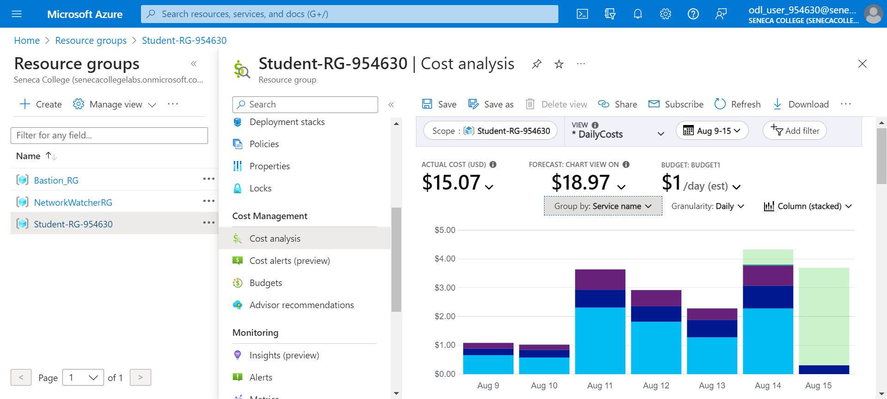
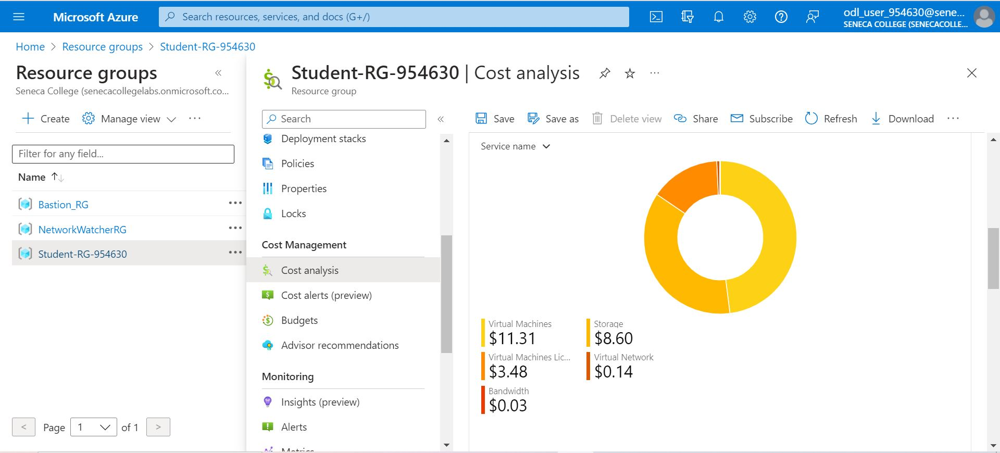

# Checkpoint 10 Submission

- **COURSE INFORMATION: CSN400NDD**
- **STUDENT’S NAME: Aleksander Savotchka**
- **STUDENT'S NUMBER: 115894214**
- **GITHUB USER ID: 122903715-myseneca**
- **TEACHER’S NAME: Atoosa Nasiri**

### Table of Contents

1. [Part A – Route Table Updates](#header1)
2. [Part B – Port Forwarding Basic Connectivity](#header2)
3. [Part C – Logging & Isolating Masqueraded Packets](#header3)
4. [Part D - Azure Cost Analysis Charts](#haeder4)

### Part A:
```
DisableBgpRoutePropagation    Location       Name       ProvisioningState    ResourceGroup      ResourceGuid
----------------------------  -------------  ---------  -------------------  -----------------  ------------------------------------       
False                         canadacentral  RT-153     Succeeded            Student-RG-954630  a0dbb142-1ed1-46df-b09a-bdcc38b3926c       
False                         canadacentral  RT-EX-153  Succeeded            Student-RG-954630  949ff826-472e-4eba-88a2-1df631ba2340 
```
**RT-153 Routes:**
```
AddressPrefix      HasBgpOverride    Name              NextHopIpAddress    NextHopType       ProvisioningState    ResourceGroup
-----------------  ----------------  ----------------  ------------------  ----------------  -------------------  -----------------
172.17.153.32/27   False             Route-to-Server   192.168.153.36      VirtualAppliance  Succeeded            Student-RG-954630
10.45.147.0/24     False             Route-to-Desktop  192.168.153.36      VirtualAppliance  Succeeded            Student-RG-954630
192.168.115.32/27  False             External-Router   192.168.153.36      VirtualAppliance  Succeeded            Student-RG-954630
```
**RT-EX-153 Routes:**
```
AddressPrefix      HasBgpOverride    Name          NextHopIpAddress    NextHopType       ProvisioningState    ResourceGroup
-----------------  ----------------  ------------  ------------------  ----------------  -------------------  -----------------
192.168.115.32/27  False             Route-to-Hub  192.168.99.36       VirtualAppliance  Succeeded            Student-RG-954630
```
**Router 153 Subnet List:**
```
AddressPrefix       Name    PrivateEndpointNetworkPolicies    PrivateLinkServiceNetworkPolicies    ProvisioningState    ResourceGroup
------------------  ------  --------------------------------  -----------------------------------  -------------------  -----------------
192.168.153.96/27   SN3     Disabled                          Enabled                              Succeeded            Student-RG-954630
192.168.153.128/27  SN4     Disabled                          Enabled                              Succeeded            Student-RG-954630
192.168.153.64/27   SN2     Disabled                          Enabled                              Succeeded            Student-RG-954630
192.168.153.32/27   SN1     Disabled                          Enabled                              Succeeded            Student-RG-954630
```

### Part B:
**Nat Ip Tables:**
```
# to flush NAT tables
iptables -t nat -F

# to allow other students to access APACHE server
iptables -t nat -A PREROUTING -p tcp --dport 28153 -j DNAT --to-destination 172.17.153.37:80

# to allow other students to access MySQL server
iptables -t nat -A PREROUTING -p tcp --dport 26153 -j DNAT --to-destination 172.17.153.37:3306

# to allow other students to access Linux server - SSH
iptables -t nat -A PREROUTING -p tcp --dport 22153 -j DNAT --to-destination 172.17.153.37:22

# to allow other students to access IIS server
iptables -t nat -A PREROUTING -p tcp --dport 29153 -j DNAT --to-destination 172.17.153.36:80

# to allow other students to access Windows server - RDP
iptables -t nat -A PREROUTING -p tcp --dport 23153 -j DNAT --to-destination 172.17.153.36:3389

# post routing
iptables -t nat -A POSTROUTING -o eth0 -j MASQUERADE
```
**Firewall IP Tables:**
```
# Flush All Iptables Chains/Firewall rules
echo "-------------------------------------------"
echo "Flush All Iptables Chains/Firewall rules"
iptables -F

# Delete all Iptables Chains
echo "-------------------------------------------"
echo "Delete all Iptables Chains"
iptables -X

# Allow any INPUT tcp traffic if RELATED or ESTABLISHED
echo "-------------------------------------------"
echo "Allow any INPUT tcp traffic if RELATED or ESTABLISHED"
iptables -A INPUT -p tcp -m state --state RELATED,ESTABLISHED -j ACCEPT

# Allow icmp traffic into the VM
echo "-------------------------------------------"
echo "Allow icmp traffic into the VM"
iptables -A INPUT -p icmp -j ACCEPT

# Allow any traffic from loopback interface into the VM
echo "-------------------------------------------"
echo "Allow any traffic from loopback interface into the VM"
iptables -A INPUT -i lo -j ACCEPT

# Allow all SSH traffic on port 22 from Source IP subnet student_vnet
echo "-------------------------------------------"
echo "Allow all SSH traffic on port 22 from Source IP subnet student_vnet"
iptables -A INPUT -p tcp -s 10.45.147.0/24 -m state --state NEW --dport 22 -j ACCEPT

# Log before DROPPING
echo "-------------------------------------------"
echo "Add a rule to LOG instead of DROPPING INPUT packets"
iptables -A INPUT -p all -m limit --limit 10/s -j LOG  --log-prefix "TO_DROP_INPUT"

# Reject all other INPUT traffic
# echo "-------------------------------------------"
# echo "Reject all other INPUT traffic"
iptables -A INPUT -j DROP


# Allow forwarding SSH traffic on port 22 from Windows Client to Server SN1
echo "-------------------------------------------"
echo "SSH"
echo "Allow forwarding all SSH traffic on port 22 from any source to any destination"
iptables -A FORWARD -p tcp -s 10.45.147.0/24 -d 172.17.153.32/27 --dport 22 -j ACCEPT
iptables -A FORWARD -p tcp -s 172.17.153.32/27 -d 10.45.147.0/24 --sport 22 -j ACCEPT

echo "DNS"
iptables -A FORWARD -p tcp -d 172.17.153.36 --dport 53 -j ACCEPT
iptables -A FORWARD -p tcp -s 172.17.153.36 --sport 53 -j ACCEPT
iptables -A FORWARD -p udp -d 172.17.153.36 --dport 53 -j ACCEPT
iptables -A FORWARD -p udp -s 172.17.153.36 --sport 53 -j ACCEPT


# Allow forwarding RDP traffic on port 3389 from from Windows Client to Server SN1
echo "-------------------------------------------"
echo "RDP"
echo "Allow forwarding all RDP traffic on port 3389 from any source to any destination"
iptables -A FORWARD -p tcp -s 10.45.147.0/24 -d 172.17.153.32/27 --dport 3389 -j ACCEPT
iptables -A FORWARD -p tcp -s 172.17.153.32/27 -d 10.45.147.0/24 --sport 3389 -j ACCEPT


echo "-------------------------------------------"
echo "MySQL"
echo "allow any tcp traffic pass through Source WC-118 subnet to Destination LS-118 for destination MySQL protocol"
iptables -A FORWARD -p tcp -s 10.45.147.0/24 -d 172.17.153.37 --dport 3306 -j ACCEPT
echo "allow any tcp traffic pass through Source WS-118 to destination WC-118 subnet for source MySQL protocol"
iptables -A FORWARD -p tcp -d 10.45.147.0/24 -s 172.17.153.37 --sport 3306 -j ACCEPT


echo "-------------------------------------------"
echo "Apache"
echo "allow any tcp traffic pass through Source WC-118 subnet to Destination WS-118 for destination Apache protocol"
iptables -A FORWARD -p tcp -s 10.45.147.0/24 -d 172.17.153.37 --dport 80 -j ACCEPT
echo "allow any tcp traffic pass through Source WS-118 to destination WC-118 subnet for source Apache protocol"
iptables -A FORWARD -p tcp -d 10.45.147.0/24 -s 172.17.153.37 --sport 80 -j ACCEPT


echo "-------------------------------------------"
echo "IIS"
echo "allow any tcp traffic pass through Source WC-118 subnet to Destination LR-118 for destination HTTP protocol to access IIS"
iptables -A FORWARD -p tcp -s 10.45.147.0/24 -d 172.17.153.36 --dport 80 -j ACCEPT
echo "allow any tcp traffic pass through Source LS-118 to destination WC-118 subnet for source HTTP protocol to access IIS"
iptables -A FORWARD -p tcp -d 10.45.147.0/24 -s 172.17.153.36 --sport 80 -j ACCEPT

echo "-------------------------------------------"
echo "FTP Administration Port"
echo "allow any tcp traffic pass through Source WC-118 subnet to Destination LR-118 for destination FTP protocol"
iptables -A FORWARD -p tcp -s 10.45.147.0/24 -d 172.17.153.36 --dport 21 -j ACCEPT
echo "allow any tcp traffic pass through Source LS-118 to destination WC-118 subnet for source FTP protocol"
iptables -A FORWARD -p tcp -d 10.45.147.0/24 -s 172.17.153.36 --sport 21 -j ACCEPT

echo "-------------------------------------------"
echo "FTP DATA Port"
echo "allow any tcp traffic pass through Source WC-118 subnet to Destination LR-118 for destination FTP protocol"
iptables -A FORWARD -p tcp -s 10.45.147.0/24 -d 172.17.153.36 --dport 50000:51000 -j ACCEPT
echo "allow any tcp traffic pass through Source LS -118 to destination WC-118 subnet for source FTP protocol"
iptables -A FORWARD -p tcp -d 10.45.147.0/24 -s 172.17.153.36 --sport 50000:51000 -j ACCEPT


## allow custom port for partner Apache Server
iptables -A FORWARD -p tcp -s 10.45.147.0/24 -d 192.168.115.36 --dport 18115 -j ACCEPT
iptables -A FORWARD -p tcp -s 192.168.115.36 -d 10.45.147.0/24 --sport 18115 -j ACCEPT

# allow custom port for partner MySQL Server
iptables -A FORWARD -p tcp -s 10.45.147.0/24 -d 192.168.115.36 --dport 16115 -j ACCEPT
iptables -A FORWARD -p tcp -s 192.168.115.36 -d 10.45.147.0/24 --sport 16115 -j ACCEPT

# allow custom port for partner IIS Server
iptables -A FORWARD -p tcp -s 10.45.147.0/24 -d 192.168.115.36 --dport 19115 -j ACCEPT
iptables -A FORWARD -p tcp -s 192.168.115.36 -d 10.45.147.0/24 --sport 19115 -j ACCEPT

# allow custom port for partner Windows Server RDP
iptables -A FORWARD -p tcp -s 10.45.147.0/24 -d 192.168.115.36 --dport 13115 -j ACCEPT
iptables -A FORWARD -p tcp -s 192.168.115.36 -d 10.45.147.0/24 --sport 13115 -j ACCEPT

# allow custom port88115 for partner Linux Server SSH
iptables -A FORWARD -p tcp -s 10.45.147.0/24 -d 192.168.115.36 --dport 12115 -j ACCEPT
iptables -A FORWARD -p tcp -s 192.168.115.36 -d 10.45.147.0/24 --sport 12115 -j ACCEPT

# allow partner traffic after NAT mapping
#HTTP
iptables -A FORWARD -p tcp -s 192.168.115.36 --dport 80 -j ACCEPT
iptables -A FORWARD -p tcp -d 192.168.115.36 --sport 80 -j ACCEPT
# SSH
iptables -A FORWARD -p tcp -s 192.168.115.36 --dport 22 -j ACCEPT
iptables -A FORWARD -p tcp -d 192.168.115.36 --sport 22 -j ACCEPT
# RDP
iptables -A FORWARD -p tcp -s 192.168.115.36 --dport 3389 -j ACCEPT
iptables -A FORWARD -p tcp -d 192.168.115.36 --sport 3389 -j ACCEPT
#MySQL
iptables -A FORWARD -p tcp -s 192.168.115.36 --dport 3306 -j ACCEPT
iptables -A FORWARD -p tcp -d 192.168.115.36 --sport 3306 -j ACCEPT
#To log


# Log before DROPPING
echo "-------------------------------------------"
echo "Add a rule to LOG instead of DROPPING FORWARD packets"
iptables -A FORWARD -p all -m limit --limit 10/s -j LOG --log-prefix "TO_DROP_FORWARD"

# Reject all other FORWARD traffic from this machine
# echo "-------------------------------------------"
# echo "Reject all other FORWARD traffic from this machine"
iptables -A FORWARD -j DROP

# Allow all output traffic from this machine
echo "-------------------------------------------"
echo "Allow all output traffic from this machine"
iptables -A OUTPUT -j ACCEPT

# List current iptables status
echo "-------------------------------------------"
echo "list current iptables status"
iptables -nvL --line-number
```

### Part C:


```
Aug 12 17:08:56 LR-153 kernel: TO_DROP_FORWARDIN=eth0 OUT=eth0 MAC=00:0d:3a:ff:1c:74:74:83:ef:6a:71:5b:08:00 SRC=192.168.115.36 DST=172.17.153.36 LEN=52 TOS=0x00 PREC=0x00 TTL=125 ID=49207 DF PROTO=TCP SPT=49986 DPT=80 WINDOW=64240 RES=0x00 SYN URGP=0

Aug 11 20:11:54 LR-153 kernel: TO_DROP_FORWARDIN=eth0 OUT=eth0 MAC=00:0d:3a:ff:1c:74:c0:d6:82:95:96:1d:08:00 SRC=192.168.115.36 DST=172.17.153.37 LEN=40 TOS=0x00 PREC=0x00 TTL=125 ID=6569 DF PROTO=TCP SPT=51325 DPT=80 WINDOW=2050 RES=0x00 ACK FIN URGP=0 

Aug 12 17:15:11 LR-153 kernel: TO_DROP_FORWARDIN=eth0 OUT=eth0 MAC=00:0d:3a:ff:1c:74:74:83:ef:6a:71:5b:08:00 SRC=192.168.115.36 DST=172.17.153.37 LEN=40 TOS=0x00 PREC=0x00 TTL=125 ID=49740 DF PROTO=TCP SPT=50097 DPT=3306 WINDOW=2050 RES=0x00 ACK FIN URGP=0

Aug 12 17:16:17 LR-153 kernel: TO_DROP_FORWARDIN=eth0 OUT=eth0 MAC=00:0d:3a:ff:1c:74:74:83:ef:6a:71:5b:08:00 SRC=192.168.115.36 DST=172.17.153.36 LEN=706 TOS=0x00 PREC=0x00 TTL=125 ID=49789 DF PROTO=TCP SPT=50134 DPT=3389 WINDOW=2048 RES=0x00 ACK PSH URGP=0

Aug 12 17:16:00 LR-153 kernel: TO_DROP_FORWARDIN=eth0 OUT=eth0 MAC=00:0d:3a:ff:1c:74:74:83:ef:6a:71:5b:08:00 SRC=192.168.115.36 DST=172.17.153.37 LEN=968 TOS=0x00 PREC=0x00 TTL=62 ID=2810 DF PROTO=TCP SPT=39596 DPT=22 WINDOW=268 RES=0x00 ACK PSH URGP=0 
```

# Part D:
# Azure Cost Analysis Charts


| No. | Scope | Chart Type | VIEW Type |  Date Range | Group By | Granularity| Example |
|-|-|-|-|-|-|-|-|
|1|Student-RG-954630| Column (Stacked) | DailyCosts | Last 7 Days | Resource | Daily |  |
|2|Student-RG-954630| Column (Stacked) | DailyCosts | Last 7 Days | Service | Daily |  |
|3|Student-RG-954630| Area| AccumulatedCosts | Last 7 Days | Resource | Accumulated |  |
|4|Student-RG-954630| Pie Chart | NA | Last Month | Service Name | NA |  |
|5|Student-RG-954630| Pie Chart | NA | Last Month | Service Family | NA |  |
|6|Student-RG-954630| Pie Chart | NA | Last Month | Product | NA |  |