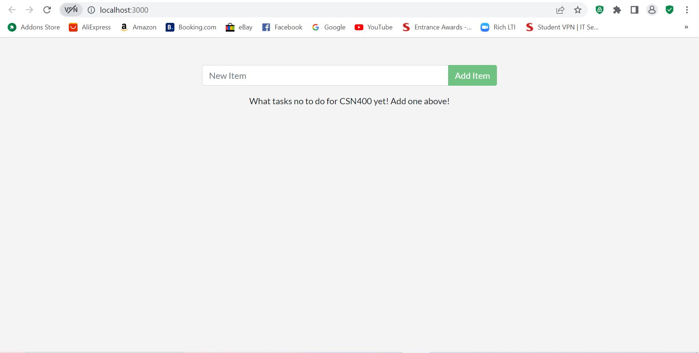
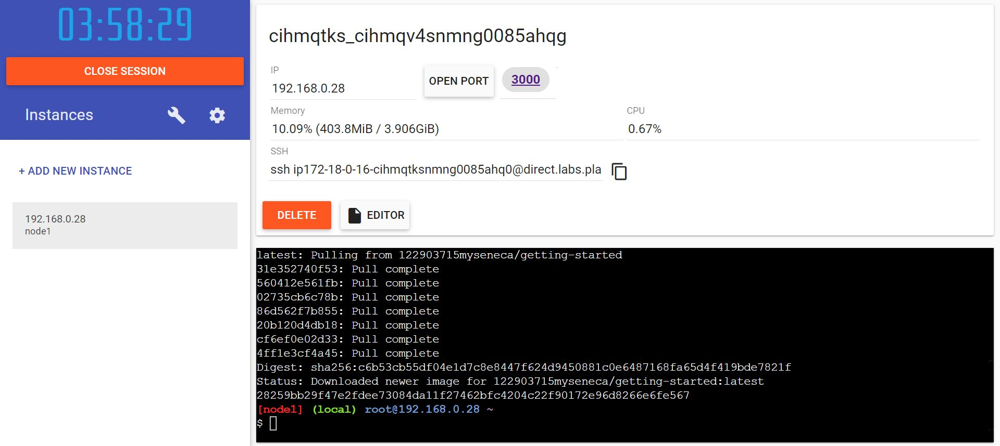
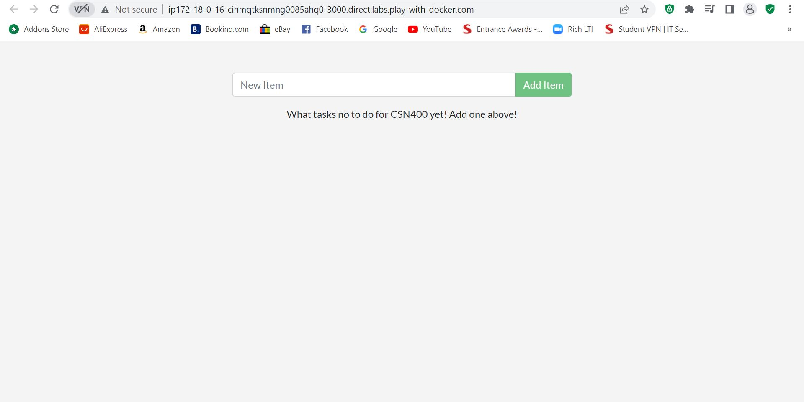
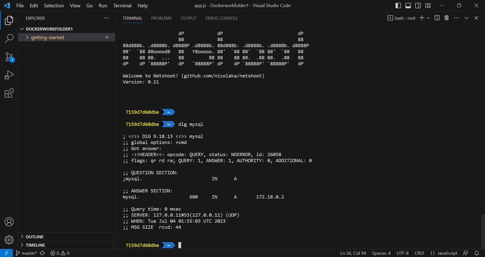

# Checkpoint5 Submission

- **COURSE INFORMATION: CSN400NDD**
- **STUDENT’S NAME: Aleksander Savotchka**
- **STUDENT'S NUMBER: 115894214**
- **GITHUB USER ID: 122903715**
- **TEACHER’S NAME: Atoosa Nasiri**
### Table of Contents
1. [Part A - Containerize an application](#part-a)
2. [Part B - Share the application](#part-b)
3. [Part C - Persist the DB](#part-c)
4. [Part D - Multi container apps](#part-d)

## Part A
### Question 1:
When you run the docker build command for the second time, factors such as caching, changes in the Dockerfile or changes in the base images may occur, making it different from the first build. Caching can speed up builds by reusing the unchanged layers in the build, and any modifcations can slow down the overall second build. In regards to the number of steps, the builds could vary based on the Dockerfile or the overall build context. You can add or remove certain instructions from the Dockerfile, which will either add or reduce the number of steps.

### Question 2:
The -t flag in the docker build is essentially a command that is used to add a tag to the built image. Tags are mainly used to identify images, and label them accordingly. In fact, if you are not using -t when you run the "docker build," command, the system will show an error that indicates that the tag is missing.

### Question 3:
Running docker build with the same tag multiple times will create multiple images throughout the build process. However, Docker will only keep the most recent image with the same tag in order to save disk space on the system. So when you are running "docker image ls," only the most recent image created will be displayed with the tag that is used.

### Question 4:
-d flag stands for "detached," mode. Esentially, this flag starts up the container in the background, and detaches it from the terminal session. This means that you can still use the terminal while the container continues to run seperatly. The -p flag is used to publish and map out ports, and specifies the port mapping in the format of host-port and container-port. If we run the command "docker run -p 1000:3000 getting-started," without the -d flag, the output should show us the output of the container in our current terminal. Without the -d flag, the container still runs in the background.

### Question 5:
localhost:1000. As mentioned above, the format of -p flag is host-port and then container-port. So in order to access the container we must used the 1000 port, as the containers port is 3000.

### Question 6:
The difference between the two containers is the images they are based on, and the port mappings. Having seperate containers for different services improves management and scalability.

### Question 7:
It was indeed shorter than the first time I did it. This is because (as mentioned in question 1) the system used the old container files in order to make the new container under a different image.

### Question 8:
"docker: Error response from daemon: driver failed programming external connectivity on endpoint laughing_burnell 
(bb242b2ca4d67eba76e79474fb36bb5125708ebdabd7f45c8eaf16caaabde9dd): Bind for 127.0.0.1:3000 failed: port is already allocated."

The error occured due to the fact that the previous container is still running. Both containers cannot use the same localhost port of 3000 and only one process can listen to a specific port. To fix this, we must remove the old container.

### Question 9:


## Part B:



## Part C:
```
[
    {
        "CreatedAt": "2023-07-04T01:13:59Z",
        "Driver": "local",
        "Labels": null,
        "Mountpoint": "/var/lib/docker/volumes/todo-db/_data",
        "Name": "todo-db",
        "Options": null,
        "Scope": "local"
    }
]
```
## Part D:

