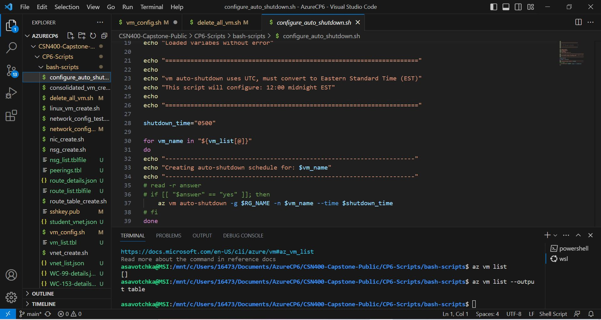

# Checkpoint6 Submission

- **COURSE INFORMATION: CSN400NDD**
- **STUDENT’S NAME: Aleksander Savotchka**
- **STUDENT'S NUMBER: 115894214**
- **GITHUB USER ID: 122903715**
- **TEACHER’S NAME: Atoosa Nasiri**

### Table of Contents
1. [Part A - Creating Network Resources using Azure CLI](#part-a)
2. [Part B - Working with Azure CLI Bash](#part-b)
3. [Part C - Network Review Questions](#part-c)
4. [Part D - Creating Virtual Machines](#part-d)

## Part A
### Update the lines that are specific to your network in Network Configuration file network_config.sh:
```
RG_NAME="Student-RG-954630" # your student group
LOCATION="canadacentral"    # your location
ID="153" #unique ID assigned to you

Student_vnet_name="Student-954630-vnet"
Student_vnet_address="10.45.147.0/24"
Client_Subnet_name="Virtual-Desktop-Client"
Client_Subnet_address="10.45.147.0/24"
```

### 1. **In network_config_test.sh what does ```if [[ ! $(az group list -o tsv --query "[?name=='$RG_NAME']") ]]``` do?**
This command is used to determine if a resource group within the variable $RG_NAME already exists or not.

### **```2.Why is it crucial to check if a resource exist before creating it? What bash syntax do you use to test this? How do you check if a vnet exists in vnet_create.sh?```**
It is crucial to check if a resource exists before creating it because many duplicate conflict errors may occur, easpically if you have full permissions to add and delete resources. The bash syntax you use to test this is:
```
echo "Checking status for Resource Group: $RG_NAME"
if [[ ! $(az group list -o tsv --query "[?name=='$RG_NAME']") ]]
then
    echo "doesn't exit! Program will abort now!"
    exit 3
else 
   echo "exists!"
   echo "Resource groups:"
   az group list --out table
fi
```

### 3. **```What is the Azure CLI command to create vnet? Give the specific command as per your environment and unique ID configuration. What are the required and what are the optional parameters that you need to pass to it?```**

The Azure CLI command to create a vnet is ```az network vnet create``` The parameters that are required are resource group name, the name of the VNET, and subnets. The optional parameters would be subnet prefixes.

### 4. **```What is the Azure CLI command to create subnet? Give the specific command as per your environment and unique ID configuration. What are the required and what are the optional parameters that you need to pass to it?```**

The command to create a subnet is az network vnet subnet create. The paramters required are resource-group, vnet-name, name, and address prefixes.

## Part B:
### 1. [List all VNETs using az network vnet list command and send the output in json format to vnet_list.jsonfile](#vnet_list.json)

### 2. [Get the details of your default student vnet using az show command and send the output in json format to student_vnet.json file](#student_vnet.json)

### 3. [List all peerings using az network vnet peering list command and send the output in table format to peerings.tblfile](#peerings.tblfile)

### 4. Get the details of your Router-XX subnet SN1 using az show command in json format and query it for details of subnet and rout associations.
```
{
  "addressPrefix": "192.168.153.32/27",
  "delegations": [],
  "etag": "W/\"2bb41b29-09e7-46d8-8a97-207a9f10f4fd\"",
  "id": "/subscriptions/71d310bf-1718-4d11-87d1-99a7d4e2053f/resourceGroups/Student-RG-954630/providers/Microsoft.Network/virtualNetworks/Router-153/subnets/SN1",
  "name": "SN1",
  "privateEndpointNetworkPolicies": "Disabled",
  "privateLinkServiceNetworkPolicies": "Enabled",
  "provisioningState": "Succeeded",
  "resourceGroup": "Student-RG-954630",
  "serviceEndpoints": [],
  "type": "Microsoft.Network/virtualNetworks/subnets"
}
```
### 5. [List all routes in RT-xx using az network route-table route list command and send the output in table format to route_list.tblfile](#route_list.tblfile)

### 6. [Get the details of route between your Router-xx SN1 and Server-xx SN using az network route-table route show and send the output in json format to route_details.json](#route_details.json)

## Part C:
### 1. **```What is Azure Virtual Network (VNET)? Elaborate in your own words```**
VNET'S are essentially used for networking purposes to create subnets, peerings, and is considered to be your network in the cloud and a "digtialized," version of an actual network room.

### 2. **```In the context of Hybrid Cloud architecture. How on-prem computers can access resources inside Azure virtual network?```**
We can use S2S(Site to site,) or Azure Express route, which provides a private connection between your on-prem hardware and Azure. Through these protocols, we can access resources inside the Azure virtual network.

### 3. **```What are the most important benefits of Azure Virtual Networks?```** 
Firstly, VNET's are a cloud network that is digtialized on Azure, which makes it better for accessibly, easier to manage, and great for scalibity as opposed to a physical network. VNET's also offer better security features such as NSG's Azure firewall etc.

### 4. **``What is the difference between Network Security Group (NSG) and Route-Tables?``**
Route-tables are mainly used to define routing rules for traffic within a virtual network. NSG's are mainly used for traffic management for security purposes (control network traffic flow, virtual firewall, adding network security policies etc.) Route tables determine how the network traffic is directed, and NSG's control and manage the traffic flow.

### 5. **```What is the difference between NSG and Firewalls?```**
NSG'S control and manage the traffic flow of the network, and are mainly used for security purposes such as controlling network traffic flow, adding network security policies etc. Whereas the firewall is focused on the overall security of the resource groups and virtual networks (enabling inbound rules etc.)

### 6. **```What is a hob-and-spoc network topology and how be deployed in Azure Cloud?```**
A hob-and-spoc is a network topology that consists of VNET'S, peerings, virtual network gateways and VM's. You can deploy a hob-and-spoc topology by using scripts in VScode, and configuring subnet's, networking addresses, and the names of resources.

### 7. **```In working with Azure VNETs, do you need to to define gateways for Azure to route traffic between subnets?```**
When working with Azure VNETs, you do not need to define gateways to route traffic between subnets. Azure routes traffic between the subnets within the VNET without needing any additional configuration.

### 8. **```When do you need to configure and use Virtual Network Gateways?```**
When you are connecting multiple VNET's together, and want to interconnect all of them, you can use virtual network gateways to create a secure connection.

## Part D:
### 1. List all VMs and send the output in table format to vm_list.tbl file. What command did you use?
```The command I used was:``` 
```
az vm list --output table > vm_list.tbl
```

### 2. [Get the details of your WC-99 using az show command and send the output in json format to WC-99-details.json file. What command did you use?](#wc-153-details.json)
```The command I used was:``` 
```
az vm show --name WC-153 --resource-group Student-RG-954630 --output json > WC-153-details.json
```

### 3. [List all NSG using az list command and send the output in table format to nsg_list.tblfile. What command did you use?](#nsg_list.tblfile)
```The command I used was:``` 
```
az network nsg list --output table > nsg_list.tblfile
```

### 5. After deleting list all your VMs using az  vm list ... with the output in table format. What command did you use? How can you ensure all your VMs are deleted?
```The command you can use to ensure all VMs are deleted is:```
```
az vm list --deleted --output table
```

### 6. Provide screenshot of auto shutdown configuration for LS_XX. Is there any command to show this? What is the time-zone? What should be the correct time settings considering the time zone differences?



```The time zone is in the international time zone. Which means when EST time is 12:00 am, the international time is 5:00 am, which is shown in the configuration file. The correct time settings considering that we are using Canada Central in this case, should be in central time.```

