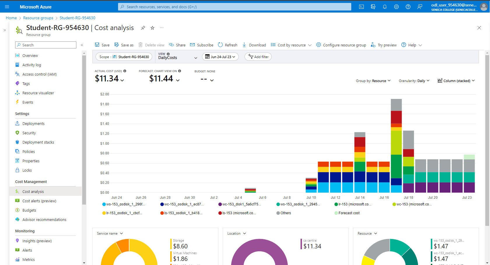
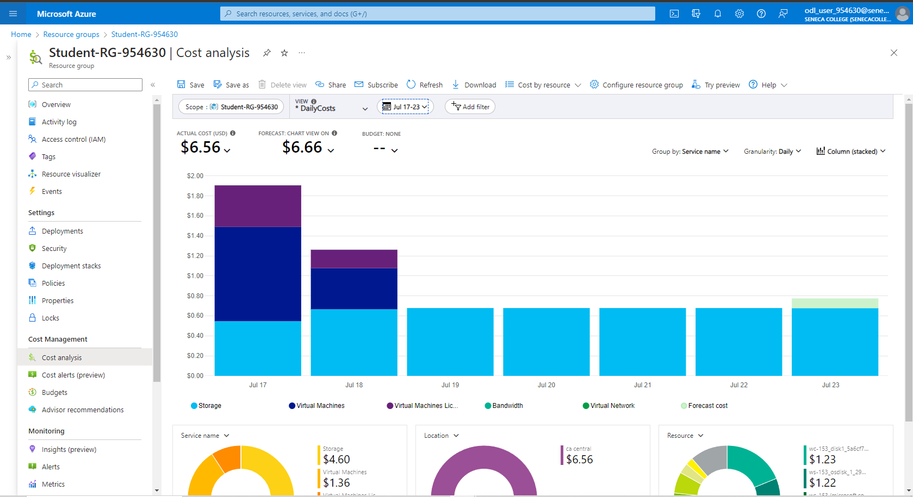
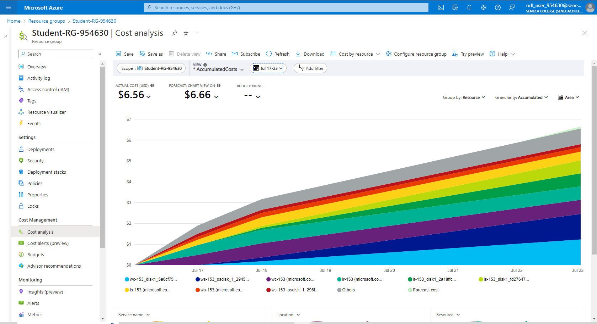
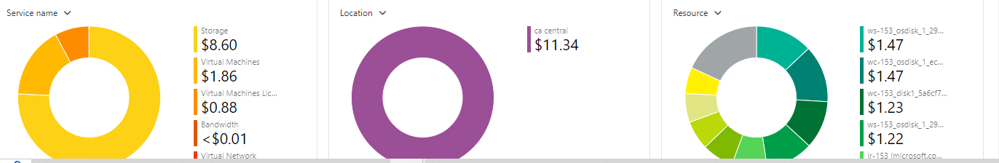
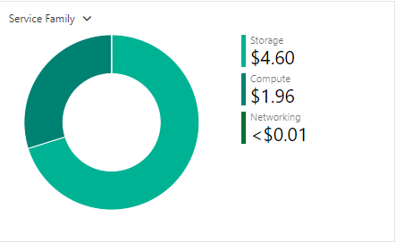
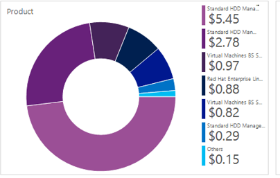
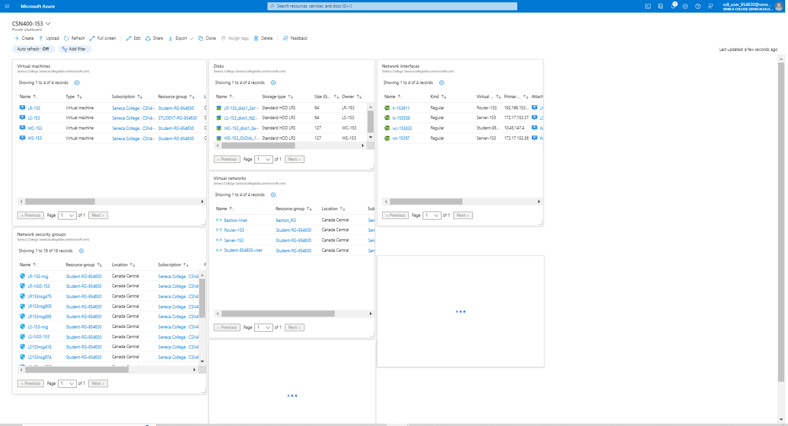

# Checkpont7 Submission

- **COURSE INFORMATION: CSN400NDD**
- **STUDENT’S NAME: Aleksander Savotchka**
- **STUDENT'S NUMBER: 115894214**
- **GITHUB USER ID: 122903715**
- **TEACHER’S NAME: Atoosa Nasiri**

### Table of Contents

1. [Part A - Creating & Configuring VMs - Using Portal](#part-a)
2. [Part B - Enable IP_Forwarding - Using Portal](#part-b)
3. [Part C - Basic Connectivity - VM Configuration](#part-c)
4. [Part D - Creating & Configuring VM Images - Using Portal](#part-d)
5. [Part E - Azure Cost Analysis Charts](#part-e)
6. [Part F - Create Customized Azure Dashboard](#part-f)

## Part A:
1. **What is the difference between Windows machine NSG and Linux machine NSG rules? Why? Do not give screenshots just describe the difference? Do you need a rule for ssh or rdp? What happens if you delete specific ssh and rdp rules?:**

```
Windows machine NSG's and Linux machine NSG's have different requirements and protocols. Firstly, Windows machines such as WS-153 typically require us to RDP for remote access using port 3389. Whilst Linux machines require an SSH remote access through port 22, and do not use port 3389 for remote connection. SSH requires a .pem key that can be used from the local machine to remotely connection using the "ssh -i," command. RDP requires a forwarding connection from the "LR," Linux Router machine in order for RDP to be successful. If you delete specific SSH and RDP rules, there will be a problem with overall connectivity between the machines. You may not be able to SSH or RDP remotely to the required machines.
```

2. **Work from Azure Bash CLI in Portal to get a list of your VM, NSG, NIC, and Disks. You can start with the below commands. Make sure the outputs in table format are embedded in your submission.**

**`az group list -out table`:**
```
Name               Location       Status   
-----------------  -------------  ---------
Bastion_RG         canadacentral  Succeeded
NetworkWatcherRG   canadacentral  Succeeded
Student-RG-954630  canadacentral  Succeeded
```
**`az vm list -g $RG -o table`:**
```
Name    ResourceGroup      Location       Zones  
------  -----------------  -------------  -------
LR-153  Student-RG-954630  canadacentral
LS-153  Student-RG-954630  canadacentral
WC-153  Student-RG-954630  canadacentral
WS-153  Student-RG-954630  canadacentral
```
**`az network nic list -g $RG -o table`:**
```
EnableAcceleratedNetworking    EnableIPForwarding    Location       MacAddress         Name       NicType    Primary    
ProvisioningState    ResourceGroup      ResourceGuid                          VnetEncryptionSupported
-----------------------------  --------------------  -------------  -----------------  ---------  ---------  ---------  
-------------------  -----------------  ------------------------------------  -------------------------
False                          True                  canadacentral  00-22-48-3C-F6-F3  lr-15370   Standard   True       
Succeeded            Student-RG-954630  7658cbeb-84d0-45eb-985a-2921777ec51e  False
False                          False                 canadacentral  00-22-48-B1-A2-74  ls-153137  Standard   True       
Succeeded            Student-RG-954630  de833313-08be-43f1-bb26-53a064a00e7a  False
False                          False                 canadacentral  60-45-BD-5B-8A-BA  wc-153715  Standard   True       
Succeeded            Student-RG-954630  dab90e2f-e373-48ee-b87e-882435a4ee25  False
False                          False                 canadacentral  00-22-48-AD-CA-6F  ws-153870  Standard   True       
Succeeded            Student-RG-954630  90034f0a-d08a-4376-9416-08087cfffe70  False
```
**`az network nsg list -o table`:**
```
Location       Name        ProvisioningState    ResourceGroup      ResourceGuid
-------------  ----------  -------------------  -----------------  ------------------------------------
canadacentral  LR-153-nsg  Succeeded            Student-RG-954630  9c94c8fa-ecf2-4c1d-a518-91f2936a5556
canadacentral  LR-NSG-153  Succeeded            Student-RG-954630  61caa697-df01-42df-94d9-bdf44c6c128a
canadacentral  LS-153-nsg  Succeeded            Student-RG-954630  a9041f68-bff3-4acf-a19e-1f89b17ae34f
canadacentral  LS-NSG-153  Succeeded            Student-RG-954630  243bc668-ae26-4ecb-bc80-0f12ae25affb
canadacentral  WC-153-nsg  Succeeded            Student-RG-954630  9ef41551-95d9-4fb3-932c-a92a381fdc8d
canadacentral  WC-NSG-153  Succeeded            Student-RG-954630  77ee9e90-1ae1-46b9-90da-a99b3148070e
canadacentral  WS-153-nsg  Succeeded            Student-RG-954630  533a8ddb-0268-4d74-add6-993c0b23d92d
canadacentral  WS-NSG-153  Succeeded            Student-RG-954630  12ba5f24-7e73-424c-a6b2-06bd41f10ab4
```
**`az disk list -g $RG -o table`:**
```
Name                                              ResourceGroup      Location       Zones    Sku           OsType    SizeGb    ProvisioningState
------------------------------------------------  -----------------  -------------  -------  ------------  --------  --------  -------------------
LR-153_OsDisk_1_cbcff7ac9c79489981c59287b371cb98  Student-RG-954630  canadacentral           Standard_LRS  Linux     64 
       Succeeded
LS-153_OsDisk_1_b418d4cde64d4212b1e9dbdd3a9e405d  Student-RG-954630  canadacentral           Standard_LRS  Linux     64 
       Succeeded
WC-153_OsDisk_1_ec875a19037e4bca9da56ebb6f356f44  Student-RG-954630  canadacentral           Standard_LRS  Windows   127       Succeeded
WS-153_OsDisk_1_296f16ecb48b43b3ad9e31eb82112f43  Student-RG-954630  canadacentral           Standard_LRS  Windows   127       Succeeded
```

## Part B:
1. **Check the status of ip-forwarding using the command az network nic ip-config show with output format as json. Include only the command not output including the --quey you used in your submission.**
```
az network nic ip-config show --resource-group Student-RG-954630 --name Student-954630-vnet --nic-name lr-15370
```

2. **When your output format is json, which property shows the status of the ip-forwarding attribute? Embed only the property that shows the status of ip-forwarding.**
```
{
  "status": "enabled",
  "ip-forwarding": true,
  "other_properties": "other_values"
}
```

## Part C:
1. **In configuring your Linux VMs, for the step "Remove the firewalld service", which command will you be using?**
```
sudo systemctl stop firewalld
sudo systemctl disable firewalld
sudo systemctl mask firewalld
sudo systemctl remove firewalld
```
2. **In configuring your Linux VMs, what command do you use to check the status of iptabels?**
```
sudo systemctl status iptables
```
3. **How can you make iptables service start automatically after reboot on CenOS/RHEL8?**
```
Use the command "sudo systemctl enable iptables," and "sudo systemctl start iptables." After running these commands, the iptables service will automatically start upon each system reboot.
```
4. **Run a command in LR-xx that shows all iptables chains with their order number. What is the default setting? Include both the command and its output in your submission. How could you improve these settings to be less vulnerable to attacks?**
```
sudo iptables -nvL

Chain INPUT (policy ACCEPT)
num  target     prot opt source               destination
1    ACCEPT     all  --  anywhere             anywhere             state RELATED,ESTABLISHED
2    ACCEPT     icmp --  anywhere             anywhere
3    ACCEPT     all  --  anywhere             anywhere
4    ACCEPT     tcp  --  anywhere             anywhere             state NEW tcp dpt:ssh
5    REJECT     all  --  anywhere             anywhere             reject-with icmp-host-prohibited

Chain FORWARD (policy ACCEPT)
num  target     prot opt source               destination
1    REJECT     all  --  anywhere             anywhere             reject-with icmp-host-prohibited

Chain OUTPUT (policy ACCEPT)
num  target     prot opt source               destination

To improve these settings to be less vulnrable to attacks, we must limit the amount of ports we open, limit certain access to specific IP's, and configuring SSH access to only our private network.
```
5. **Run a command that shows the hostname in LR-XX and LX-XX. Embed the output in your submission.**
```
Static hostname: LR-153.CSN4002234.com
         Icon name: computer-vm
           Chassis: vm
        Machine ID: 453c95589ac44adfa31654d4a34fb87f
           Boot ID: 13114265435044fca0bb62fc4dc1893e
    Virtualization: microsoft
  Operating System: Red Hat Enterprise Linux 8.8 (Ootpa)
       CPE OS Name: cpe:/o:redhat:enterprise_linux:8::baseos
            Kernel: Linux 4.18.0-425.13.1.el8_7.x86_64
      Architecture: x86-64

   Static hostname: LS-153.CSN4002234.com
         Icon name: computer-vm
           Chassis: vm
        Machine ID: 453c95589ac44adfa31654d4a34fb87f
           Boot ID: 792b2837b0ba4fa9b07c2e1c7e9936db
    Virtualization: microsoft
  Operating System: Red Hat Enterprise Linux 8.8 (Ootpa)
       CPE OS Name: cpe:/o:redhat:enterprise_linux:8::baseos
            Kernel: Linux 4.18.0-477.15.1.el8_8.x86_64
      Architecture: x86-64
```
## Part D:
1. **Run a command in CLI that lists all your Custom Images. Hint: az image list .... Change the output format to table format and embed the answer in your submission.**
```
HyperVGeneration    Location       Name              ProvisioningState    ResourceGroup    
------------------  -------------  ----------------  -------------------  -----------------
V2                  canadacentral  lr-153-ver-0.0.1  Succeeded            STUDENT-RG-954630
V2                  canadacentral  ls-153-ver-0.0.1  Succeeded            STUDENT-RG-954630
V2                  canadacentral  wc-153-ver-0.0.1  Succeeded            STUDENT-RG-954630
```
2. **Delete your VMs after your work is completed. Run a command in CLI that lists all your VMs. Hint: az vm list .... Change the output format to table format and embed the answer in your submission.**
```
Name    ResourceGroup      Location       Zones  
------  -----------------  -------------  -------
LR-153  STUDENT-RG-954630  canadacentral
LS-153  STUDENT-RG-954630  canadacentral
WC-153  STUDENT-RG-954630  canadacentral
WS-153  STUDENT-RG-954630  canadacentral
```
3. **Recreate all VMs from your images, and establish basic connectivity. How long the entire process took? How can you do this more efficiently?**
```
This entire process took about 20 minutes. We had to create new virtual machines through the portal using the images that we have created. Although it was faster than creating the VM's without the images, we can do this more efficiently by implementing a script from our WSL, in order to create these virtual machines based on the images.
```
## Part E:
| No. | Scope | Chart Type | VIEW Type |  Date Range | Group By | Granularity| Example |
|-|-|-|-|-|-|-|-|
|1|Student-RG-954630| Column (Stacked) | DailyCosts | Last 7 Days | Resource | Daily |  |
|2|Student-RG-954630| Column (Stacked) | DailyCosts | Last 7 Days | Service | Daily |  |
|3|Student-RG-954630| Area| AccumulatedCosts | Last 7 Days | Resource | Accumulated |  |
|4|Student-RG-954630| Pie Chart | NA | Last Month | Service Name | NA |  |
|5|Student-RG-954630| Pie Chart | NA | Last Month | Service Family | NA |  |
|6|Student-RG-954630| Pie Chart | NA | Last Month | Product | NA |  |

## Part F:


