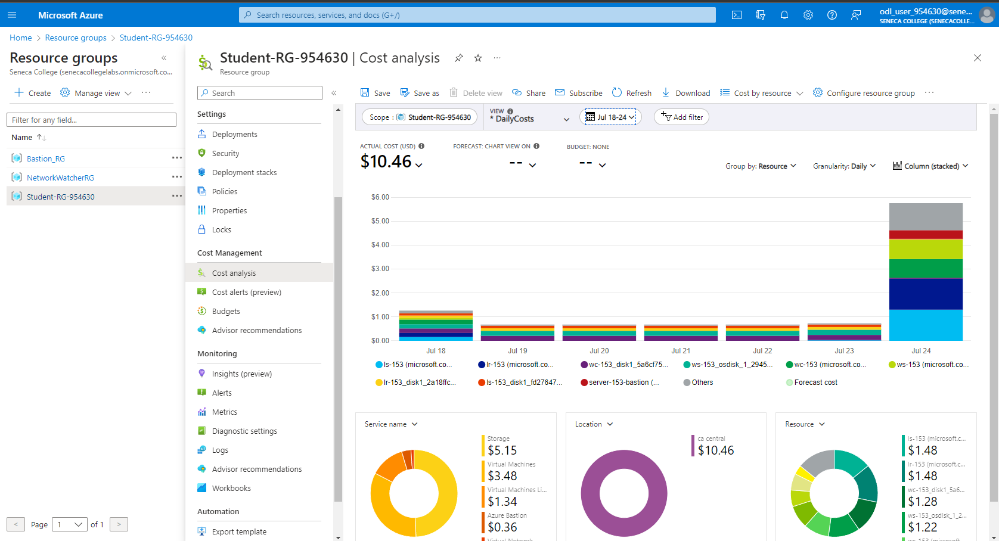
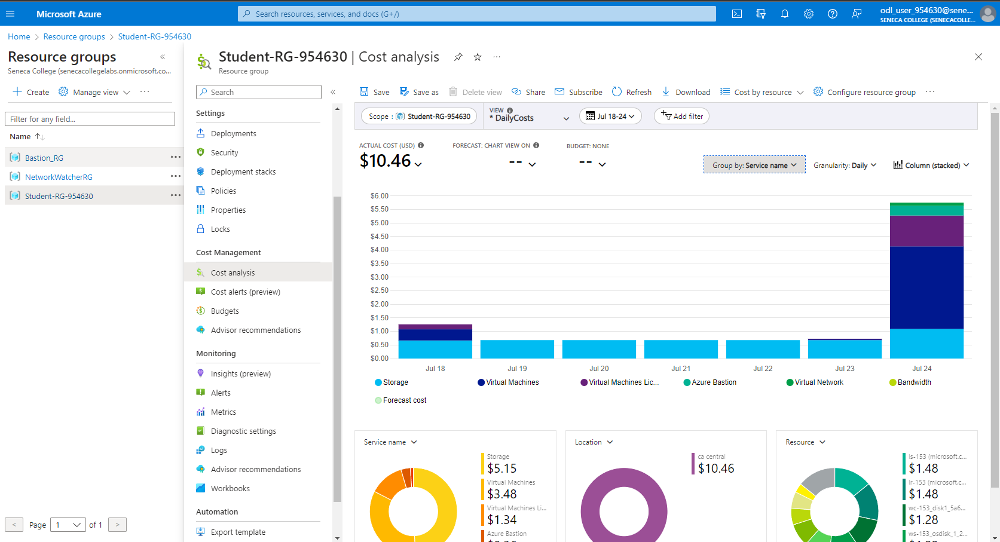
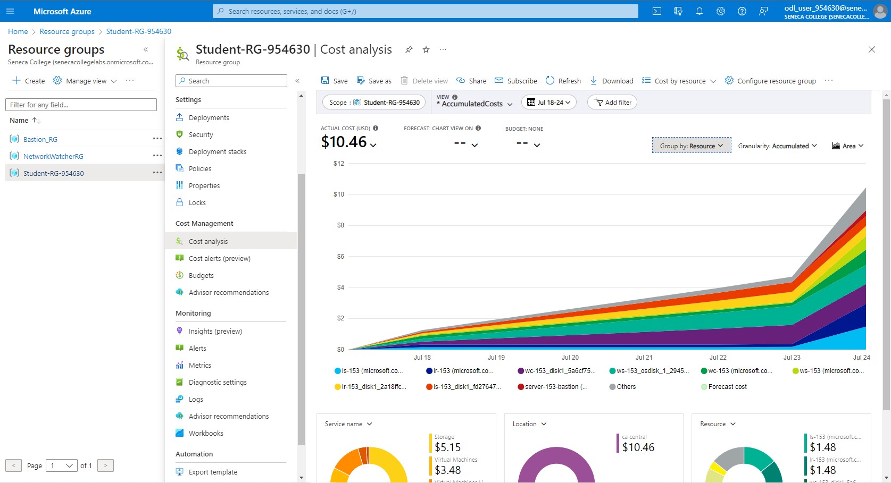
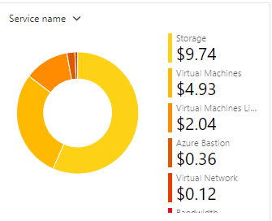
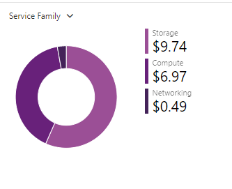
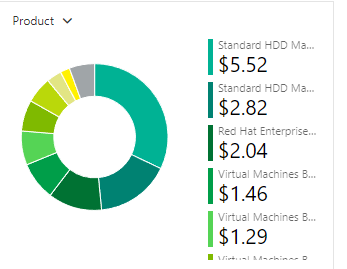
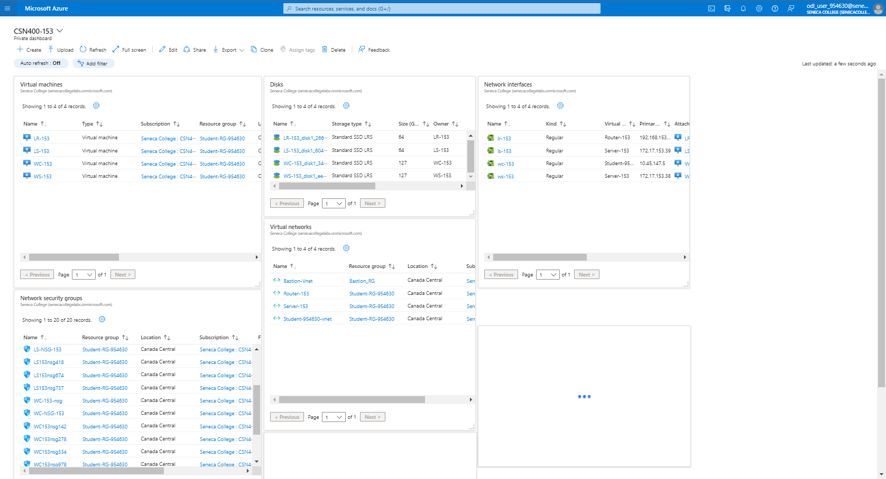

# Checkpoint8 Submission

- **COURSE INFORMATION: CSN400NDD**
- **STUDENT’S NAME: Aleksander Savotchka**
- **STUDENT'S NUMBER: 115894214**
- **GITHUB USER ID: 122903715**
- **TEACHER’S NAME: Atoosa Nasiri**

### Table of Contents

1. [Part A - Creating & Configuring VMs - Using Azure CLI Scripts](#header)
2. [Part B - Basic Connectivity - Linux VMs Firewall Setting](#header)
3. [Part C - Azure Cost Analysis Charts](#header)

## Part A:
1. **Get a list of your VM, NSG, NIC, and Disks using Azure CLI in table format. Do not include screenshots, just embed the output in table format in your submission.**

az vm list --output table:
```
Name    ResourceGroup      Location       Zones  
------  -----------------  -------------  -------
LR-153  STUDENT-RG-954630  canadacentral
LS-153  STUDENT-RG-954630  canadacentral
WC-153  STUDENT-RG-954630  canadacentral
WS-153  STUDENT-RG-954630  canadacentral
```
az network nsg list --output table:
```
Location       Name         ProvisioningState    ResourceGroup      ResourceGuid
-------------  -----------  -------------------  -----------------  ------------------------------------
canadacentral  LR-153-nsg   Succeeded            Student-RG-954630  9c94c8fa-ecf2-4c1d-a518-91f2936a5556
canadacentral  LR153nsg475  Succeeded            Student-RG-954630  324aed0d-4e48-4965-baba-827f80cd72b6
canadacentral  LR153nsg605  Succeeded            Student-RG-954630  c330c0d7-6ba9-4538-b2a4-9dc136844cac
canadacentral  LR153nsg885  Succeeded            Student-RG-954630  6fdd39ca-5506-4612-9e7d-0650038c11fb
canadacentral  LR-NSG-153   Succeeded            Student-RG-954630  61caa697-df01-42df-94d9-bdf44c6c128a
canadacentral  LS-153-nsg   Succeeded            Student-RG-954630  a9041f68-bff3-4acf-a19e-1f89b17ae34f
canadacentral  LS153nsg418  Succeeded            Student-RG-954630  894841d0-6d1d-4bf7-bcf1-cc5e93ba8e48
canadacentral  LS153nsg674  Succeeded            Student-RG-954630  b474976d-c2f3-41d9-a215-68191d83fd80
canadacentral  LS153nsg737  Succeeded            Student-RG-954630  1537ec6a-b731-4d4e-96d9-2b17e95d4d01
canadacentral  LS-NSG-153   Succeeded            Student-RG-954630  243bc668-ae26-4ecb-bc80-0f12ae25affb
canadacentral  WC-153-nsg   Succeeded            Student-RG-954630  9ef41551-95d9-4fb3-932c-a92a381fdc8d
canadacentral  WC153nsg142  Succeeded            Student-RG-954630  2189cc3f-b7a0-48cf-96cd-b17dfa512395
canadacentral  WC153nsg278  Succeeded            Student-RG-954630  8fdf5841-9840-427c-847e-a9e3f3c2d8f6
canadacentral  WC153nsg334  Succeeded            Student-RG-954630  f2424994-a032-4437-a08d-2872b81f1e2b
canadacentral  WC153nsg978  Succeeded            Student-RG-954630  69484dcb-f6a8-4c88-8bba-80e94f433955
canadacentral  WC-NSG-153   Succeeded            Student-RG-954630  77ee9e90-1ae1-46b9-90da-a99b3148070e
canadacentral  WS-153-nsg   Succeeded            Student-RG-954630  c3bae373-3b3a-4749-87b4-60b3422b9bf3
canadacentral  WS153nsg495  Succeeded            Student-RG-954630  9301dcbd-ed97-4577-9967-5bca67aeaeca
canadacentral  WS153nsg800  Succeeded            Student-RG-954630  ec065da1-1a3b-4ce3-8294-f0940d43868c
canadacentral  WS-NSG-153   Succeeded            Student-RG-954630  7ae94d8f-0229-4919-801b-060fbb6c041c
```
az network nic list --output table:
```
EnableAcceleratedNetworking    EnableIPForwarding    Location       MacAddress         Name    NicType    Primary    ProvisioningState    ResourceGroup      ResourceGuid                          VnetEncryptionSupported
-----------------------------  --------------------  -------------  -----------------  ------  ---------  ---------  -------------------  -----------------  ------------------------------------  -------------------------
False                          True                  canadacentral  60-45-BD-5C-CB-41  lr-153  Standard   True       Succeeded    
        Student-RG-954630  8fdf02ca-f30e-468e-8673-7429d91ab07a  False
False                          True                  canadacentral  00-22-48-AD-AD-3C  ls-153  Standard   True       Succeeded    
        Student-RG-954630  68cb5d08-df46-4b96-8b54-df26216f3ec1  False
False                          True                  canadacentral  00-0D-3A-E9-A7-7D  wc-153  Standard   True       Succeeded    
        Student-RG-954630  5410640d-e8f7-4bdd-b941-cf347fa23b18  False
False                          True                  canadacentral  00-0D-3A-0C-27-78  ws-153  Standard   True       Succeeded    
        Student-RG-954630  323073e8-ecad-4182-a240-e45ba3cd1777  False
```
az disk list --output table:
```
Name                                              ResourceGroup      Location       Zones    Sku              OsType    SizeGb    
ProvisioningState
------------------------------------------------  -----------------  -------------  -------  ---------------  --------  --------  
-------------------
LR-153_OsDisk_1_abaa33859a0e483381c4362528525989  STUDENT-RG-954630  canadacentral           StandardSSD_LRS  Linux     64        
Succeeded
LS-153_OsDisk_1_cf2d9d8c260b4776b3bfdc215254a9e2  STUDENT-RG-954630  canadacentral           StandardSSD_LRS  Linux     64        
Succeeded
WC-153_OsDisk_1_0e81b9d71c0242c5a78ebff2aad408fa  STUDENT-RG-954630  canadacentral           StandardSSD_LRS  Windows   127       
Succeeded
WS-153_OsDisk_1_c91254c6ce564053b7a7b3a004355581  STUDENT-RG-954630  canadacentral           StandardSSD_LRS  Windows   127       
Succeeded
```
2. **Why are you creating NIC separate from VM? What happens when you delete a VM, is that attached NIC automatically deleted? Why?**

Creating the NIC seperate from the VM is great for reusability, NSG associations, and when you delete a VM, the NIC is still up. This means that we can configure the NIC device to our liking without the dependence of a virtual machine.

3. **When you created VMs from Portal can you use an existing NIC? Do you consider this a limitation in working from Portal for VM creation?**

Yes, you have the option to use an existing NIC when you create a new virtual machine. The feature allows you to use a pre-existing NIC and attach it to a new VM during the creation process. It provides flexibility, and is convient when you configured the NIC with specific networking settings. So I do not see this as a limitation in working from portal.

4. **What rules did we add to Network Security Groups (NSG)? What does each rule do?**

Creation of NSG's VIA script:
```
WC_NSG_name="WC-NSG-$ID"
LR_NSG_name="LR-NSG-$ID"
LS_NSG_name="LS-NSG-$ID"
WS_NSG_name="WS-NSG-$ID"

declare -a NSG_list=("$WC_NSG_name" "$LR_NSG_name" "$LS_NSG_name" "$WS_NSG_name")
```
The rules that we changed is allowing imbound port 22 and 3389 (ssh and RDP,) and creating subnets.

5. **Run a command in CLI that lists all your Custom Images. Change the output format to table format and embed the answer in your submission.**
```
HyperVGeneration    Location       Name              ProvisioningState    ResourceGroup    
------------------  -------------  ----------------  -------------------  -----------------
V2                  canadacentral  lr-153-ver-0.0.1  Succeeded            STUDENT-RG-954630
V2                  canadacentral  lr-153-ver-10     Succeeded            STUDENT-RG-954630
V2                  canadacentral  ls-153-ver-0.0.1  Succeeded            STUDENT-RG-954630
V2                  canadacentral  ls-153-ver-10     Succeeded            STUDENT-RG-954630
V2                  canadacentral  wc-153-ver-0.0.1  Succeeded            STUDENT-RG-954630
V2                  canadacentral  wc-153-ver-10     Succeeded            STUDENT-RG-954630
V2                  canadacentral  ws-153-ver-0.0.1  Succeeded            STUDENT-RG-954630
V2                  canadacentral  ws-153-ver-10     Succeeded            STUDENT-RG-954630
```
6. **Delete your VMs using the proper script after your work is completed. Run a command in CLI that lists all your VMs.**
```
Name    ResourceGroup      Location       Zones  
------  -----------------  -------------  -------
LR-153  STUDENT-RG-954630  canadacentral
LS-153  STUDENT-RG-954630  canadacentral
WC-153  STUDENT-RG-954630  canadacentral
WS-153  STUDENT-RG-954630  canadacentral
```
7. **Get a list of your VM, NSG, NIC, and Disks using Azure CLI in table format. Which ones are empty? Do not include screenshots, just embed the output in table format in your submission.**

az vm list --output table:
```
Name    ResourceGroup      Location       Zones  
------  -----------------  -------------  -------
LR-153  STUDENT-RG-954630  canadacentral
LS-153  STUDENT-RG-954630  canadacentral
WC-153  STUDENT-RG-954630  canadacentral
WS-153  STUDENT-RG-954630  canadacentral
```

az network nsg list --output table:
```
Location       Name         ProvisioningState    ResourceGroup      ResourceGuid
-------------  -----------  -------------------  -----------------  ------------------------------------
canadacentral  LR-153-nsg   Succeeded            Student-RG-954630  9c94c8fa-ecf2-4c1d-a518-91f2936a5556
canadacentral  LR153nsg475  Succeeded            Student-RG-954630  324aed0d-4e48-4965-baba-827f80cd72b6
canadacentral  LR153nsg605  Succeeded            Student-RG-954630  c330c0d7-6ba9-4538-b2a4-9dc136844cac
canadacentral  LR153nsg885  Succeeded            Student-RG-954630  6fdd39ca-5506-4612-9e7d-0650038c11fb
canadacentral  LR-NSG-153   Succeeded            Student-RG-954630  61caa697-df01-42df-94d9-bdf44c6c128a
canadacentral  LS-153-nsg   Succeeded            Student-RG-954630  a9041f68-bff3-4acf-a19e-1f89b17ae34f
canadacentral  LS153nsg418  Succeeded            Student-RG-954630  894841d0-6d1d-4bf7-bcf1-cc5e93ba8e48
canadacentral  LS153nsg674  Succeeded            Student-RG-954630  b474976d-c2f3-41d9-a215-68191d83fd80
canadacentral  LS153nsg737  Succeeded            Student-RG-954630  1537ec6a-b731-4d4e-96d9-2b17e95d4d01
canadacentral  LS-NSG-153   Succeeded            Student-RG-954630  243bc668-ae26-4ecb-bc80-0f12ae25affb
canadacentral  WC-153-nsg   Succeeded            Student-RG-954630  9ef41551-95d9-4fb3-932c-a92a381fdc8d
canadacentral  WC153nsg142  Succeeded            Student-RG-954630  2189cc3f-b7a0-48cf-96cd-b17dfa512395
canadacentral  WC153nsg278  Succeeded            Student-RG-954630  8fdf5841-9840-427c-847e-a9e3f3c2d8f6
canadacentral  WC153nsg334  Succeeded            Student-RG-954630  f2424994-a032-4437-a08d-2872b81f1e2b
canadacentral  WC153nsg978  Succeeded            Student-RG-954630  69484dcb-f6a8-4c88-8bba-80e94f433955
canadacentral  WC-NSG-153   Succeeded            Student-RG-954630  77ee9e90-1ae1-46b9-90da-a99b3148070e
canadacentral  WS-153-nsg   Succeeded            Student-RG-954630  c3bae373-3b3a-4749-87b4-60b3422b9bf3
canadacentral  WS153nsg495  Succeeded            Student-RG-954630  9301dcbd-ed97-4577-9967-5bca67aeaeca
canadacentral  WS153nsg800  Succeeded            Student-RG-954630  ec065da1-1a3b-4ce3-8294-f0940d43868c
canadacentral  WS-NSG-153   Succeeded            Student-RG-954630  7ae94d8f-0229-4919-801b-060fbb6c041c
```

az network nic list --output table:
```
EnableAcceleratedNetworking    EnableIPForwarding    Location       MacAddress         Name    NicType    Primary    ProvisioningState    ResourceGroup      ResourceGuid                          VnetEncryptionSupported
-----------------------------  --------------------  -------------  -----------------  ------  ---------  ---------  -------------------  -----------------  ------------------------------------  -------------------------
False                          True                  canadacentral  60-45-BD-5C-CB-41  lr-153  Standard   True       Succeeded    
        Student-RG-954630  8fdf02ca-f30e-468e-8673-7429d91ab07a  False
False                          False                 canadacentral  00-22-48-AD-AD-3C  ls-153  Standard   True       Succeeded    
        Student-RG-954630  68cb5d08-df46-4b96-8b54-df26216f3ec1  False
False                          True                  canadacentral  00-0D-3A-E9-A7-7D  wc-153  Standard   True       Succeeded    
        Student-RG-954630  5410640d-e8f7-4bdd-b941-cf347fa23b18  False
False                          True                  canadacentral  00-0D-3A-0C-27-78  ws-153  Standard   True       Succeeded    
        Student-RG-954630  323073e8-ecad-4182-a240-e45ba3cd1777  False
```

az disk list --output table:
```
Name                                           ResourceGroup      Location       Zones    Sku              OsType    SizeGb    ProvisioningState
---------------------------------------------  -----------------  -------------  -------  ---------------  --------  --------  -------------------
LR-153_disk1_266b6c4bc1ae440892b4ba5be0d3550a  STUDENT-RG-954630  canadacentral           StandardSSD_LRS  Linux     64        Succeeded
LS-153_disk1_604705c0c6fc4f8c8871603668697aa8  STUDENT-RG-954630  canadacentral           StandardSSD_LRS  Linux     64        Succeeded
WC-153_disk1_343912ce10934c2293c072daa387dd3a  STUDENT-RG-954630  canadacentral           StandardSSD_LRS  Windows   127       Succeeded
WS-153_disk1_eed1e66c848d473a8fd7b150017a61cc  STUDENT-RG-954630  canadacentral           StandardSSD_LRS  Windows   127       Succeeded
```
None of the outputs are empty, however, I have already created VM's based on the images so therefore the VM command would return an empty value.

## Part B:

2. **Run a command in LR-xx that show iptables chains. What is the default setting? How could you improve these settings to be less vulnerable to attacks?**

The command I used to show Iptable chains is:
```
sudo iptables -nvL or watch -n 1 sudo iptables -nvL
```
Originally before my configuration, the IP table rules were all flushed (there was no rules.) This can pose as a huge vulnrability when it comes to DDoS attacks or general network attacks.


3. **Run a command that shows the hostname in LR-XX and LX-XX and embed the output in your submission.**

LR-153:
```
   Static hostname: LR-153.CSN4002234.com
         Icon name: computer-vm
           Chassis: vm
        Machine ID: c30654a8e7de4cd68b942774c4e1ccca
           Boot ID: f3922deb27274e0695780ca61ed02b7a
    Virtualization: microsoft
  Operating System: Red Hat Enterprise Linux 8.8 (Ootpa)
       CPE OS Name: cpe:/o:redhat:enterprise_linux:8::baseos
            Kernel: Linux 4.18.0-477.15.1.el8_8.x86_64
      Architecture: x86-64
```

LS-153:
```
   Static hostname: LS-153.CSN4002234.com
         Icon name: computer-vm
           Chassis: vm
        Machine ID: c30654a8e7de4cd68b942774c4e1ccca
           Boot ID: 4081ea34e95f4019b7877c95129bd9db
    Virtualization: microsoft
  Operating System: Red Hat Enterprise Linux 8.8 (Ootpa)
       CPE OS Name: cpe:/o:redhat:enterprise_linux:8::baseos
            Kernel: Linux 4.18.0-477.15.1.el8_8.x86_64
      Architecture: x86-64
```

4. **Submit your lr_iptables.txt and ls_iptables.txt files. Do not embed them in your README.md, just add it in your folder and give a hyperlink.**

[Lr_iptables](Iptables/lr_iptables.txt)

[Ls_iptables](Iptables/ls_iptables.txt)

5. **Test your firewall settings and your configurations for basic ssh and rdp connectivity between your Desktop Client and Linux Server LS-xx and Windows Server WS-xx a few times.**

I am able to successfully ping all machines, as well as access WS-153 remotely through RDP, and I am able to access LS and LR through SSH. The IPTables configuration for LR looks like this after SSH and RDP requests:

```
Every 1.0s: sudo iptables -nvL                                                                                        LR-153.CSN4002234.com: Mon Jul 24 20:27:47 2023
Chain INPUT (policy ACCEPT 0 packets, 0 bytes)
 pkts bytes target     prot opt in     out     source               destination
 1721  314K ACCEPT     tcp  --  *      *       0.0.0.0/0            0.0.0.0/0            state RELATED,ESTABLISHED
    4   240 ACCEPT     icmp --  *      *       0.0.0.0/0            0.0.0.0/0
    0     0 ACCEPT     all  --  lo     *       0.0.0.0/0            0.0.0.0/0
    3   156 ACCEPT     tcp  --  *      *       10.45.147.0/24       0.0.0.0/0            state NEW tcp dpt:22
  141 27828 LOG        all  --  *      *       0.0.0.0/0            0.0.0.0/0            limit: avg 10/sec burst 5 LOG flags 0 level 4 prefix "TO_DROP_INPUT"
  141 27828 DROP       all  --  *      *       0.0.0.0/0            0.0.0.0/0

Chain FORWARD (policy ACCEPT 0 packets, 0 bytes)
 pkts bytes target     prot opt in     out     source               destination
   43  7534 ACCEPT     tcp  --  *      *       10.45.147.0/24       172.17.153.32/27     tcp dpt:22
   45  8306 ACCEPT     tcp  --  *      *       172.17.153.32/27     10.45.147.0/24       tcp spt:22
  333 32424 ACCEPT     tcp  --  *      *       10.45.147.0/24       172.17.153.32/27     tcp dpt:3389
  331 51414 ACCEPT     tcp  --  *      *       172.17.153.32/27     10.45.147.0/24       tcp spt:3389
    3  3780 LOG        all  --  *      *       0.0.0.0/0            0.0.0.0/0            limit: avg 10/sec burst 5 LOG flags 0 level 4 prefix "TO_DROP_FORWARD"
    3  3780 DROP       all  --  *      *       0.0.0.0/0            0.0.0.0/0

Chain OUTPUT (policy ACCEPT 0 packets, 0 bytes)
 pkts bytes target     prot opt in     out     source               destination
 2460  510K ACCEPT     all  --  *      *       0.0.0.0/0            0.0.0.0/0
 ```

## Part C:

| No. | Scope | Chart Type | VIEW Type |  Date Range | Group By | Granularity| Example |
|-|-|-|-|-|-|-|-|
|1|Student-RG-954630| Column (Stacked) | DailyCosts | Last 7 Days | Resource | Daily |  |
|2|Student-RG-954630| Column (Stacked) | DailyCosts | Last 7 Days | Service | Daily |  |
|3|Student-RG-954630| Area| AccumulatedCosts | Last 7 Days | Resource | Accumulated |  |
|4|Student-RG-954630| Pie Chart | NA | Last Month | Service Name | NA |  |
|5|Student-RG-954630| Pie Chart | NA | Last Month | Service Family | NA |  |
|6|Student-RG-954630| Pie Chart | NA | Last Month | Product | NA |  |

2.



