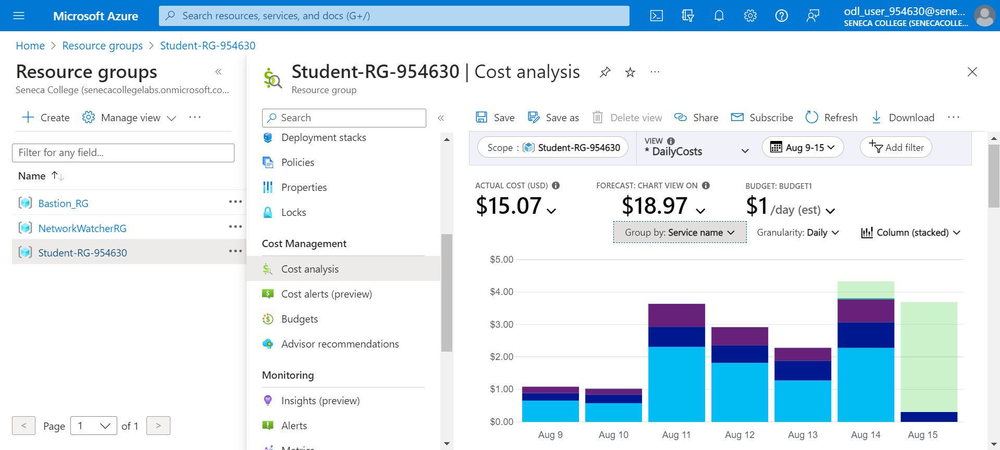
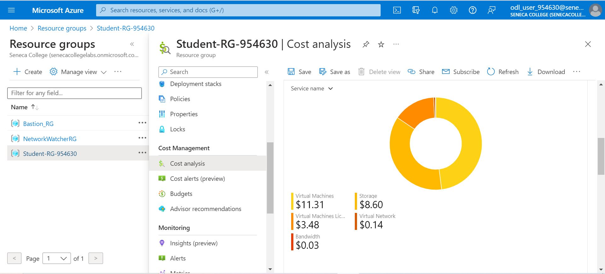

# Checkpoint9 Submission

- **COURSE INFORMATION: CSN400NDD**
- **STUDENT’S NAME: Aleksander Savotchka**
- **STUDENT'S NUMBER: 115894214**
- **GITHUB USER ID: 122903715**
- **TEACHER’S NAME: Atoosa Nasiri**

Add a table of contents sections with headers showing your specific headers
### Table of Contents

1. [Part A – Logging and Analyzing DNS and HTTP Traffic](#part-a)
2. [Part B – Logging and Analyzing FTP and MySQL Traffic](#part-b)
3. [Part C – Adjusting firewalls to DROP and LOG Traffic](#part-c)
4. [Part D - Azure Cost Analysis Charts](#part-d)

## Part A:


## Part B:


## Part C:


**Dropped Packet:**
```
Aug 13 16:53:54 LR-153 kernel: TO_DROP_INPUTIN=eth0 OUT= MAC=00:0d:3a:ff:1c:74:c0:d6:82:7c:66:f5:08:00 SRC=172.17.153.36 DST=192.168.153.36 LEN=182 TOS=0x00 PREC=0x00 TTL=128 ID=60595 PROTO=UDP SPT=53 DPT=36676 LEN=162
```
## Part D:
| No. | Scope | Chart Type | VIEW Type |  Date Range | Group By | Granularity| Example |
|-|-|-|-|-|-|-|-|
|1|Student-RG-954630| Column (Stacked) | DailyCosts | Last 7 Days | Resource | Daily |  |
|2|Student-RG-954630| Column (Stacked) | DailyCosts | Last 7 Days | Service | Daily |  |
|3|Student-RG-954630| Area| AccumulatedCosts | Last 7 Days | Resource | Accumulated |  |
|4|Student-RG-954630| Pie Chart | NA | Last Month | Service Name | NA |  |
|5|Student-RG-954630| Pie Chart | NA | Last Month | Service Family | NA |  |
|6|Student-RG-954630| Pie Chart | NA | Last Month | Product | NA |  |